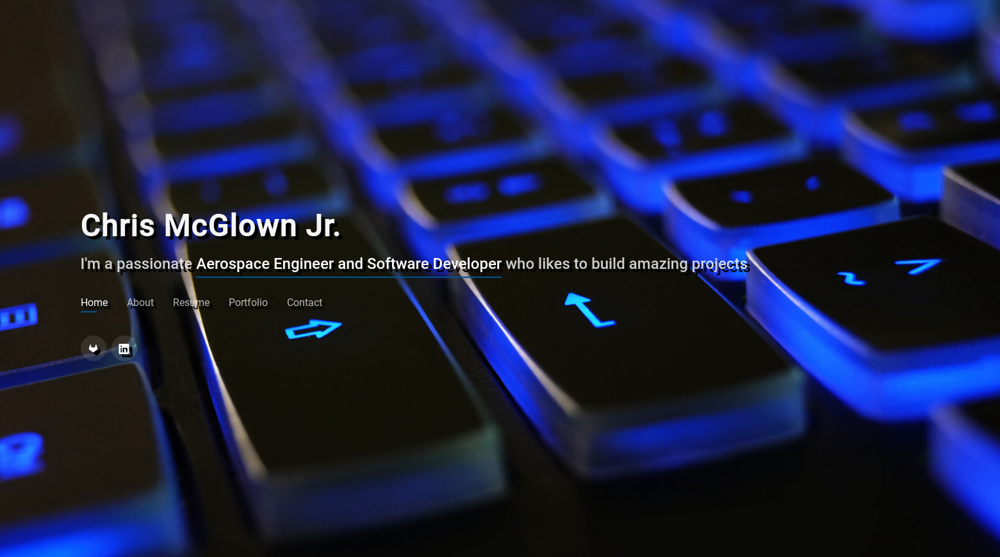

# My Personal Site

## Introduction
This is the repository of my personal site written in Python using the Django
framework. The site will be expanded over time as I improve my capabilities in
Python and Django. I plan to add a blog to it at a later date.

## Getting Started
The requirements.txt file has all the requirements necessary for this project. 
You will also need a .env file with the following variables configured:
- SECRET_KEY
- DEBUG
- DATABASE_URL
- ADMIN_SITE
- DJANGO_SECURE_SSL_REDIRECT
- DJANGO_SECURE_HSTS_SECONDS
- DJANGO_SECURE_HSTS_INCLUDE_SUBDOMAINS
- DJANGO_SECURE_HSTS_PRELOAD
- DJANGO_SESSION_COOKIE_SECURE
- DJANGO_CSRF_COOKIE_SECURE

## Usage
You are free to copy and use this for any projects you have in mind as long as
you follow the license that I have as well as BootstrapMade's.

## Screenshot

## License
This project falls under the GPLv3 license.

## Acknowledgements
The theme of this project was based on a [BootstrapMade](https://bootstrapmade.com/personal-free-resume-bootstrap-template/) 
theme that is linked in the name.